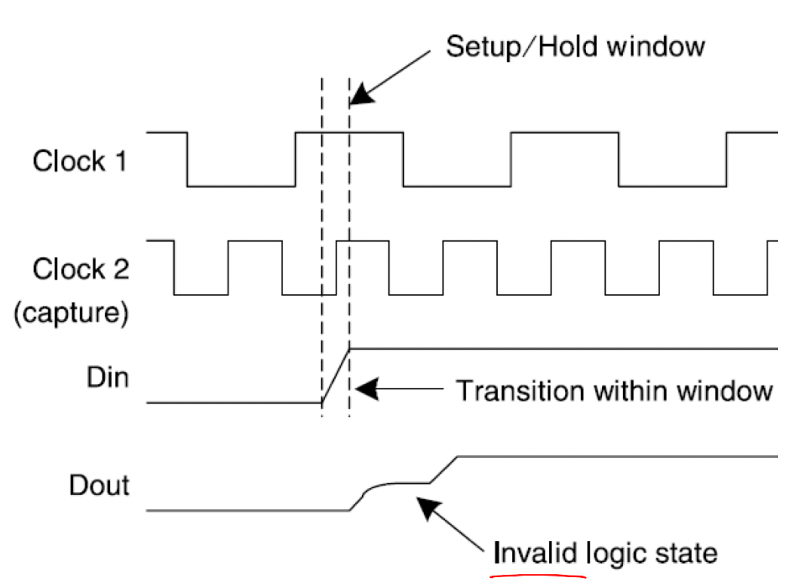

[comment]: <> (Open the markdown window with CTRL+SHIFT+M)

# Dst
## Kontrollfragen Dst Advanced RTL
### HS 2020 - Luca Krummenacher

## CDC - **C**lock **D**omain **C**rossing
1. Erklären Sie das Phänomen von Metastabilen Zuständen bei Flipflops und warum
diese in der Digitalen Schaltungstechnik unerwünscht sind.
- Bei Clockflanken kann es zu metastabilen Zuständen kommen, das ist ein
unzulässiger logischer Ausgangspegel eines FF’s (Also zwischen 0 und 1)
Diese unzulässigen Ausgangspegel können nicht korrekt weiterverarbeitet werden
und führen dabei zu Problemen.
 Ausserdem ist der weiterverarbeitet Zustand
eine zufälliger Wert, also LOW oder HIGH.

2. Wann kommt es zu Metastabilen Zuständen bei Flipflops?
- Wenn es in einer Schaltung mehrere Clocks gibt, kann es bei den Clockübergängen zu metastabilen Zuständen kommen.

- Ein nicht synchronisiertes Signal kann einen unzulässigen Zustand auslösen
Innerhalb eines bestimmten Setup / Hold - Windows muss das Eingangssignal stabil
sein. Ein Wechsel in dieser Zeit bewirkt metastabile Zutände.

  

3. Wie helfen einem ein RTL Simulator oder ein Statischer Timing Analyzer bei der Suche nach Metastabilen Zuständen?
- Die beiden Tools können dabei nicht helfen, da keine asynchronen Eingänge produziert werden. Das SDA Tool meldet aber Timing violations

4. Welche Elemente der folgenden Formel kann man beeinflussen, und wie?
- Tck-Q + Tmet + Tdly < Tperiod – Tsu

- Nur das propagation Delty (T_delay) kann verändert werden.
Das Ziel ist viele kleine Logikblöcke zwischen den FF's zu
erstellen, damit die FF's nahe beieinander liegen, was das
wiring delay reduziert.

5. Welche Gefahren lauern bei SRL (Shieberegister) und Bock RAM (BRAM)?


- Es dürfen keine SR und BRAM's verwendet werden weil sie zwischen den FF's zusätzlich Verbindungen aufweisen was zu grösseren
Delayzeiten führt (Vergleich Aufg. 6).
- SR und BRAM haben asynchrone Ausgänge, die Spikes behaftet sind.

6. Welche Synthese Constraints sollte man bei 2-FF Synchronizer definieren?


- Es ist wichtig, dass das Signal spätestens beim zweiten Synchronisations-FF stabil ist.
Folgende Formel muss eingehalten werden:

- Tck-Q + Tmet + T_dly < Tperiod – Tsu


- Um T_dly möglichst klein zu halten:
  - darf sich keine Logik zwischen den FF's befinden
  - müssen die FF's sehr nahe beinander sein
  - dürfen die FF's keine anderen Verbindungen zu anderen Gates aufweisen (ausser das letzte)

7. Welche Problematik kommt hinzu, wenn ganze Datenbusse synchronisiert werden müssen?


- Nicht alle Leitungen verhalten sich gleich bei metastabilen Zuständen und somit können falsche zufällige Werte am Ausgang entstehen.

8. Wie werden Datenbusse geeignet synchronisiert (mehrere Varianten)?


- Datenbusse können mit deb folgenden Variante gehandelt werden um das Problem aus Aufg.7 zu umgehen:
  - Graycode Codierung -> es gibt nur eine Änderung um ein bit
  - enable-based data synchronizer
  - FIFO-based synchronizer (Dual-Clock FIFO
Separater Write- und Read-Port. Die Information über die Füllstände im FIFO werden synchronisiert. Dadurch kann es zu keinen Timing-Verletzungen beim Schreiben und Lesen kommen.)

9. Welche Synchronisationsmethoden gibt es bei den Reset-Signalen?

- Variante 1: Synchronisierter asynchroner Reset mit (wir mit 2 FF synchronisiert), kurze Resetimpulse können verloren gehen
- Variante 2: Asynchronous Assertion/Synchronous Deassertion:
  - Damit kurze Resetimpulse nicht verloren gehen, wird dies mittels 2 FF mit asynchronem Reset Eingang gelöst

- Variante 2 ist they way to go!

## CORDIC

1. Erklären Sie das Konzept des Cordic Algorithmus.

- Der Cordic (**Co**ordinate **R**otation **D**igital **C**omputer) ist ein iterativer Algorithmus, welcher zum Mulitplizieren, Dividieren, sowie für trigometrische Funktionen eingesetz werden kann. Dabei benötigt er nur **Addierer** und **Schieberegister**.

2. Welche Zusammenhänge bestehen zwischen tan(&phi;) und 2-i?
- tan(&phi;i ) = 2-i


3. Was hat es auf sich mit den Skalier-Faktoren 0.6073 und 1.647?

Der Fehler der Amplitude konvergiert für unendlich viele Rotationen nach 0.6073.
Die Verstärkung An konvergiert deshalb nach 1.647.

4. Was ist der Unterschied zwischen dem Rotations-Mode und dem Vector-Mode?

- Beim **Rotations-Mode** wird der Vektor so lange gedreht, bis der Drehwinkel z gegen 0 geht.
- Beim **Vector-Mode** wird der Vektor so gedreht, dass sich die y Komponente verkleinert.

5. Was ist der Unterschied zwischen dem Zirkulären Mode und dem Linearen Mode?


6. Wie wird ein Vektor um 90 Grad gedreht?


7. Wie wird ein Vektor um 180 Grad gedreht?


8. Aus welchen Elementen besteht die Hardware, um eine Cordic-Iteration zu berechnen?
Nur aus **Addierer** und **Schieberegister**.


9. Skizzieren die Hardware für eine Cordic-Iteration.
